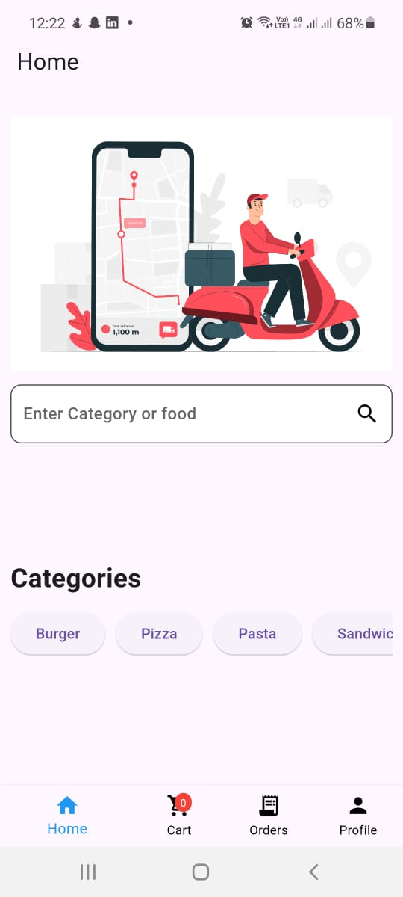
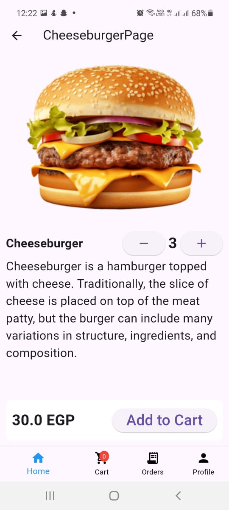
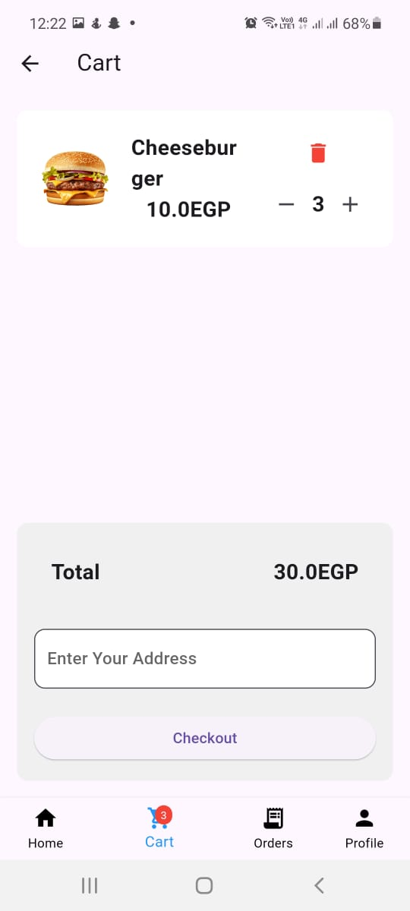

# food_deliver

A new Flutter project.

## Getting Started

This is a food delivery application in which users can add products to their carts and search for products then make a checkout and create a new order

## Application View
Here are some screenshots of the application

